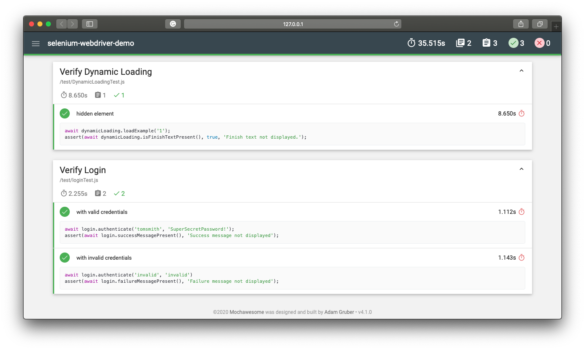

# WebUI Automated Acceptance Test using Selenium WebDriver + Javascript + Mocha

**If you have WebDriver APIs in your test methods, You're Doing It Wrong.**
_-- Simon Stewart._

<!--  -->

## Release Notes

### 1.12.5

- Tbd

### 1.12.4

- Added `download file with header` test case.

### 1.12.3

- Added `download file` test case.
- Run single test case: `npm run test /test/download.spec.js`

### 1.12.2

- Supporting Chrome 87 version.
- Supporting test run with tag and generate test execution report. `npm run test:chrome:tag sanity`

### 1.12.1

- Added `upload text file` test case.

### 1.12.0

- Run specific test case using `tag`.
- Run single test case `npm run test:tag tag-name`

### 1.11.0

- Added parallel test run support using `mocha-parallel-tests` library.
- Github Actions CI/CD run test cases in parallel.

### 1.10.1

- Fixed bug: [Test cases execution fails on Windows OS.](https://github.com/jagadeeshshetty/selenium-webdriver-demo/issues/20)

### 1.10.0

- Add `mochawesome` report support.
- Test execution report is as follows
  

### 1.9.0

- Added multiple browser support.
- Tests runs in both `Chrome` and `Firefox` UI as well as headless mode.

### 1.8.0

- Added Github Actions support for CI/CD workflow.
- Removed Travis support.

### 1.7.2

- Maintance: Chromedriver update from 81 to 84 to support chrome browser 84.x.x version.

### 1.7.1

- Bug fix: [#9 Test execution fails in Chrome Version 81.0.4044.129 (Official Build) (64-bit) browser.](https://github.com/jagadeeshshetty/selenium-webdriver-demo/issues/9)

### 1.7.0

- Optimize framework.
- Global setup and teardown.
  - Define `build()` and `quit()` methods in `DriverFactory` class.
  - Utilize `DriverFactory` through `spec_helper` module.
- Global mocha timeout.
  - Use `mocha.opts` file.
- Define URL in config file to support testing, staging, production server.

### 1.6.0

- Explicit waits support.
- Debug support.
- Handle dynamic, JavaScript heavy pages.
- Run `node node_modules/mocha/bin/mocha test/DynamicLoadingTest.js`

### 1.5.0

- Optimize - Page Object support
  - Abstract selenium common actions into a `BasePage` central place.

### 1.4.0

- Page Object support
- Test cases update
  - 'with valid credentials'
  - 'with invalid credentials'

### 1.3.0

- Add Travis CI support

### 1.2.0

- Added `loginTest.js` test case
  - Scenario
    - Valid login
- Updated `npm run test` script to run `mocha` test.

### 1.1.0

- Install
  - dependencies `npm i mocha mocha-jenkins-reporter selenium-webdriver system-sleep chromedriver geckodriver`
  - devDependencies `npm i -D mocha-simple-html-reporter mochawesome`
- Add gitignore
  - node_modules

### 1.0.0

- Initial project setup

## Reference

[Selenium Webdriver](https://www.selenium.dev/selenium/docs/api/javascript/index.html)

[mochawesome](https://www.npmjs.com/package/mochawesome#example)

[Git Basics - Tagging](https://git-scm.com/book/en/v2/Git-Basics-Tagging)
